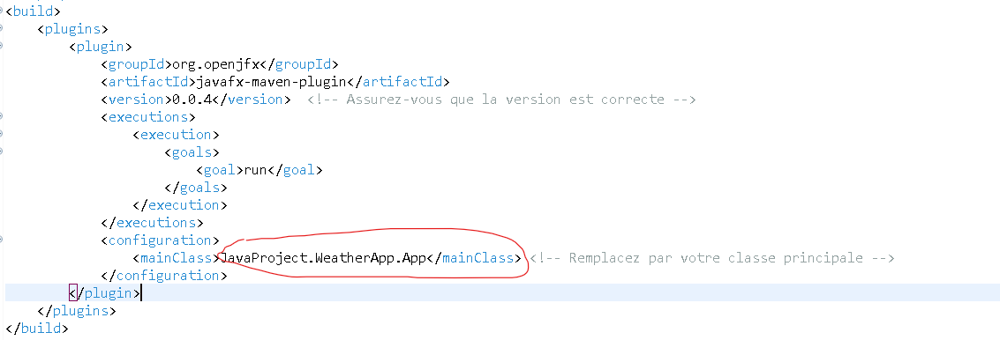
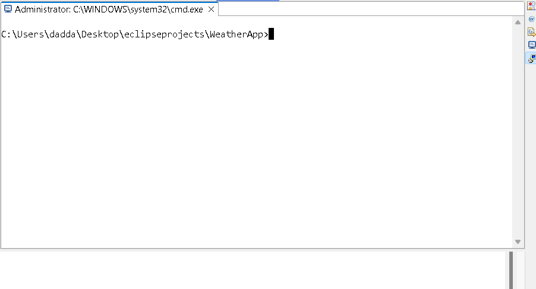
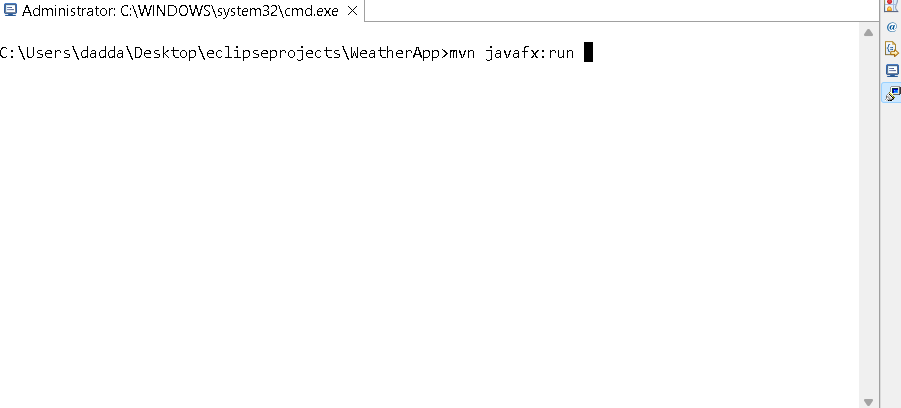
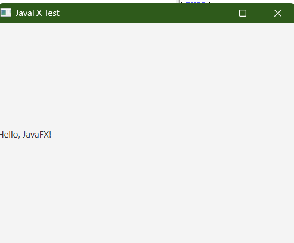

Bonjour amigos , juste pour la configuration javafx , pour qu'elle soit compatible pour toute l'équipe et pour éviter tout conflit , j'ai pas ajouté un chemin local pour javafx , c'est maven qui gére cela
mais pour l'équipe qui va travailler sur la partie des interfaces , vous devez suivre les étapes suivantes : 

# remplacer le chemin ici par celui de l'interface principale :

# ouvrir le terminal: 

# saisir la commande suivante :

# l'interface s'affiche

Donc , c'est à partir de l'interface principale qu'on va faire des appels aux autres interfaces , puisque JAVAFX est configuré pour cette interface principale. 
Comme ca , On peut travailler d'une manière unifiée sans conflit inchaalah si on a fusionner les repos après ^^ 
S'il y'a des problèmes , on va essayer de les fixer , mais pour le moment , c'est l'idée de base ^^
